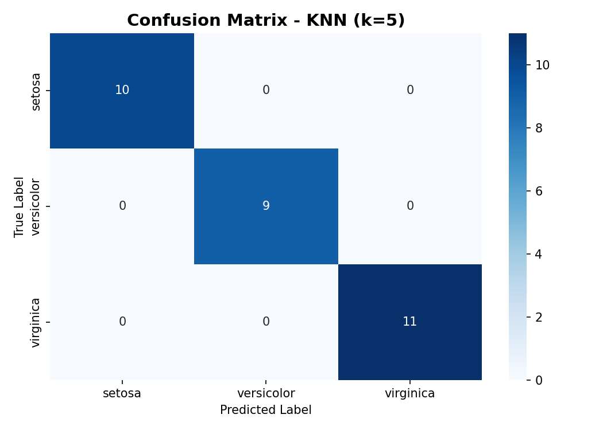
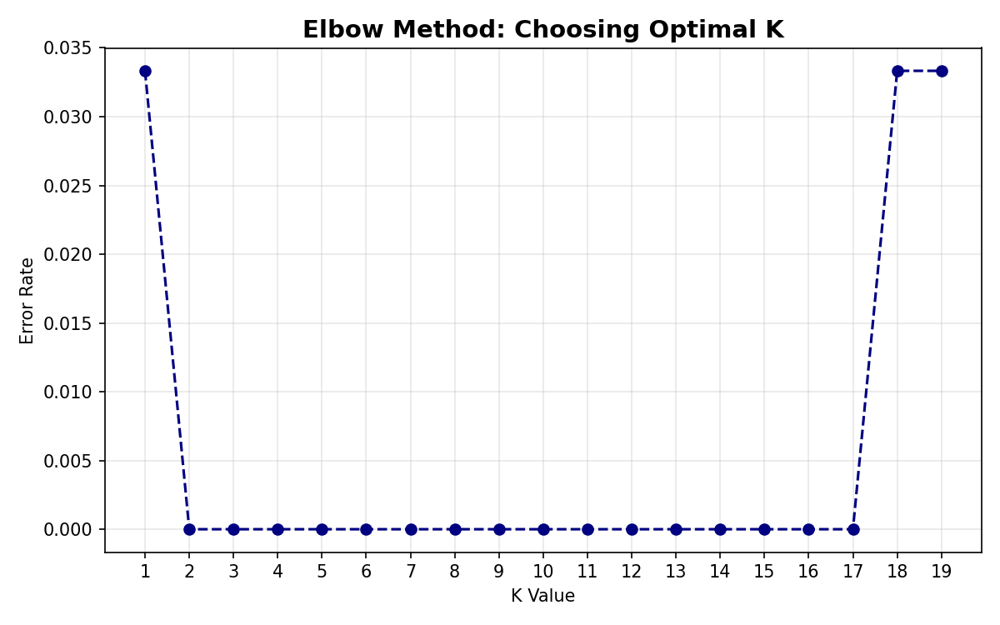

# Project 2: Data Classification Using AI

## Project Description
This project focuses on the implementation of a Supervised Machine Learning pipeline utilizing the **K-Nearest Neighbors (KNN)** algorithm. Using the standard Iris Benchmark Dataset, the system evaluates structural patterns (Sepal and Petal dimensions) to classify flowers into their respective target species. 

The pipeline ensures high structural integrity through data shuffling, feature scaling, and exhaustive hyperparameter tuning using the **Elbow Method** to choose the optimal `K` value.

## Key Technical Pillars
- **The Gatekeeper Rule (Feature Scaling):** Implemented `StandardScaler` to normalize features (Mean=0, Variance=1), preventing larger feature magnitudes from dominating distance metrics.
- **Structural Integrity (The Split):** Shuffled and partitioned data into an 80% training set (pattern recognition) and a 20% test set (validation) to eradicate any sequential order bias.
- **Hyperparameter Optimization:** Utilized the Elbow Method dynamically plotting error rates across a range of $K=1$ to $K=19$ to select the most stable neighborhood configuration ($K=5$).
- **Multi-Class Evaluation:** Validated using comprehensive Classification Reports, Weighted F1-Scores, and full Confidence/Confusion Matrices.

## Tools & Technologies
- **Language:** Python 3.x
- **Libraries:** NumPy, Pandas, Scikit-Learn, Matplotlib, Seaborn
- **Environment:** Visual Studio Code (Jupyter Notebook environment)

## Evaluation Insights & Visualization
The model achieved an exceptional **100% Accuracy** and a **1.0000 Weighted F1-Score** on the testing threshold.

### 1. Confusion Matrix Layout
Below is the generation layout showing zero classification error:

### 2. Hyperparameter Tuning (Elbow Method)
Optimizing error metrics dynamically over different values of K:

## How to Run
1. Open this project folder in Visual Studio Code.
2. Ensure you have the **Jupyter Extension** installed.
3. Open the `data_classification.ipynb` notebook file.
4. Click **Run All** to see the dataset analysis, model training, and generated curves.
